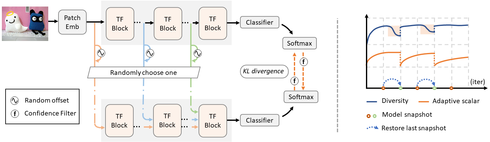
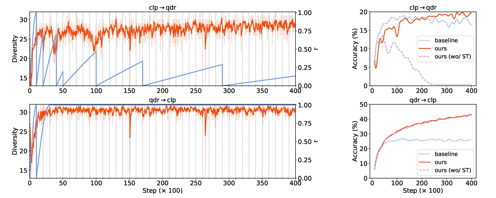

# SSRT
Pytorch implementation of SSRT. 
> [Safe Self-Refinement for Transformer-based Domain Adaptation](https://arxiv.org/abs/2204.07683)                 
> Tao Sun, Cheng Lu, Tianshuo Zhang, and Haibin Ling                 
> *CVPR 2022* 

## Abstract
Unsupervised Domain Adaptation (UDA) aims to leverage a label-rich source domain to solve tasks on a related unlabeled target domain. It is a challenging problem especially when a large domain gap lies between the source and target domains. In this paper we propose a novel solution named SSRT (Safe Self-Refinement for Transformer-based domain adaptation), which brings improvement from two aspects. First, encouraged by the success of vision transformers in various vision tasks, we arm SSRT with a transformer backbone. We find that the combination of vision transformer with simple adversarial adaptation surpasses best reported Convolutional Neural Network (CNN)-based results on the challenging DomainNet benchmark, showing its strong transferable feature representation. Second, to reduce the risk of model collapse and improve the effectiveness of knowledge transfer between domains with large gaps, we propose a Safe Self-Refinement strategy. Specifically, SSRT utilizes predictions of perturbed target domain data to refine the model. Since the model capacity of vision transformer is large and predictions in such challenging tasks can be noisy, a safe training mechanism is designed to adaptively adjust learning configuration. Extensive evaluations are conducted on several widely tested UDA benchmarks and SSRT achieves consistently the best performances, including 85.43% on Office-Home, 88.76% on VisDA-2017 and 45.2% on DomainNet.



## Usage
### Prerequisites
```shell
We experimented with python==3.8, pytorch==1.8.0, cudatoolkit==11.1
```
### Training
1. Clone this repository to local
```shell
git clone https://github.com/tsun/SSRT.git
```
2. Download the [office31](https://faculty.cc.gatech.edu/~judy/domainadapt/), [Office-Home](https://www.hemanthdv.org/officeHomeDataset.html), [VisDA](https://ai.bu.edu/visda-2017/), [DomainNet](http://ai.bu.edu/M3SDA/) datasets and extract to ./data.

3. To reproduce results in Tables 1-4 of the paper, run 
```shell
python main_SSRT.office31.py
python main_SSRT.office_home.py
python main_SSRT.visda.py
python main_SSRT.domainnet.py
```

## Acknowledgements
- The implementation of Vision Transformer is adapted from the excellent [timm](https://github.com/rwightman/pytorch-image-models/tree/master/timm) library. 
- We thank for the open-sourced repos: 
  <br/> [pytorch-image-models
](https://github.com/rwightman/pytorch-image-models) <br/>
  [Transfer-Learning-Library
](https://github.com/thuml/Transfer-Learning-Library) <br/>
  [implicit_alignment
](https://github.com/xiangdal/implicit_alignment) <br/>


  
## Reference
```bibtex
@inproceedings{sun2022safe,
    author    = {Sun, Tao and Lu, Cheng and Zhang, Tianshuo and Ling, Haibin},
    title     = {Safe Self-Refinement for Transformer-based Domain Adaptation},
    booktitle = {Proceedings of the IEEE/CVF Conference on Computer Vision and Pattern Recognition (CVPR)},
    year      = {2022}
}
```